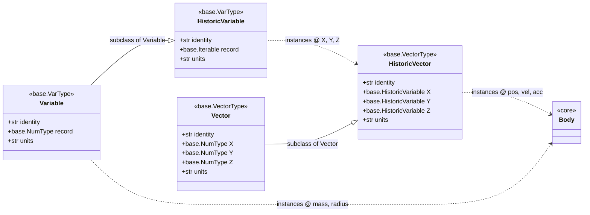

The classes and functions contained in `base`. These objects form the internals of the structures and functioning of the rest of the objects a user would interact with.
> [!WARNING]
> This Wiki is not regularly updated. this page was last checked for accuracy on **8th December 2023**.

Above is a figure visualising how the structure of the `core` class [`Body`](https://github.com/will-roscoe/nbody/wiki/Core-Structures#corebodymassinit_posinit_vel000radius0bounce0999colornoneidentitynone) is formed from objects in this module. Each `base.HistoricVector` instance in `core.Body` represents a kinematic value describing the trajectory of the `Body`.

Each `base.HistoricVector` instance is effectively comprised of 3 `base.HistoricVariable` instances, representing the components of the vector. The classes have solely been built for use in a 3D instance, but you may be able to use 2 dimensions inefficiently.


----


##  `base.Variable(init_var, identity='Variable', units=None)` 
Basic single valued object with the ability to have an identity and units. Integrates with the rest of the `base` objects properly. 
### Attributes:
|Attribute| Type| Description|
|---|---|---|
| `self.record` | [`base.NumType`](https://github.com/will-roscoe/nbody/wiki/Base-Structures#custom-type-definitions) | stores the x-component of the vector. |
| `self.identity` | `str` | identifier |
| `self.units` | `str` |units of the variable |
### Usage
#### `c()`
   - Returns value of `Variable`. 
     - equivalent to `self.record`.


----


## `base.HistoricVariable(init_var,identity='HistoricVariable',units=None)`
Subclass of `base.Variable`. single valued object that stores past values of the variable. Inherits the ability to have an identity and units. Integrates with the rest of the `base` objects properly. 
### Attributes:
|Attribute| Type| Description|
|---|---|---|
| `self.record` | `list` | stores the current and past values of the variable. |
| `self.identity` | `str` | identifier |
| `self.units` | `str` |units of the variable|
### Usage
#### `c()`
   - Returns latest value of `HistoricVariable`. 
      - equivalent to `self.record[-1]`.
#### `next(next_val)`
   - Stores new current variable value by appending.
      - equivalent to `self.record.append(next_val)`.
### Indexing
 - Supports numerical indexing but not slicing.

| Index | Returns|
|---|---|
|`'first'`, `'initial'`| initial value of variable|
|`'last'`, `'current'`| last value of variable|
|`'full'`, `'hist'`,`'all'`| all values of variable|
|`'past'`, `'old'`| all values excluding current value of variable|


----


## `base.Vector(li=None,x=None,y=None,z=None)`
Object representing a 3-vector.  Has the ability to have an identity and units, and integrates well with other `base` objects. Does not store any past values and is generally used for calculations using single points of data at a time.
### Attributes:
|Attribute| Type| Description|
|---|---|---|
| `self.X` | [`base.NumType`](https://github.com/will-roscoe/nbody/wiki/Base-Structures#custom-type-definitions) | stores the x-component of the vector. |
| `self.Y` | [`base.NumType`](https://github.com/will-roscoe/nbody/wiki/Base-Structures#custom-type-definitions) | stores the y-component of the vector. |
| `self.Z` | [`base.NumType`](https://github.com/will-roscoe/nbody/wiki/Base-Structures#custom-type-definitions) | stores the z-component of the vector. |
| `self.identity` | `str` | identifier |
| `self.units` | `str` |units of the vector components (homogenous across all components) |
### Usage
#### `c(ind=None)`
   - Returns full tuple value of `Variable`. Alternative options for `ind` are:
       * `0` --> x component,
       * `1` --> y component,
       * `2` --> z component.
#### `magnitude()`

   - Returns the magnitude (length) of the vector as a [`base.NumType`](https://github.com/will-roscoe/nbody/wiki/Base-Structures#custom-type-definitions) object.
#### `unit()`
   - Returns the unit vector of the vector as a `base.Vector` object.

#### `cross(other)`
   - Returns the cross product of the vector and `other` as a `base.Vector` object.
       * `other` must be an iterable object of length 3 or [`base.VectorType`](https://github.com/will-roscoe/nbody/wiki/Base-Structures#custom-type-definitions) object.
### Indexing
   - Does not support Numerical indexing.
| Index | Returns|
|---|---|
|`'x'`, `'i'`| x-component of the vector.|
|`'y'`, `'j'`| y-component of the vector.|
|`'z'`, `'k'`| z-component of the vector.|
|`'current'`| tuple containing all components of the vector.|


----


## `base.HistoricVector(x=None,y=None,z=None,li=None,identity=None,units_v=None)`
Subclass of `base.Vector`. Object representing a 3-vector, that stores past values of the variable whilst maintaining synchronity of length. Has the ability to have an identity and units, and integrates well with other `base` objects. Meant to be used such that it acts like a `base.Vector` until data is needing to be extracted for analysis/plotting.
### Attributes:
|Attribute| Type| Description|
|---|---|---|
| `self.X` | `base.HistoricVariable` | stores the x-component of the vector. |
| `self.Y` | `base.HistoricVariable` | stores the y-component of the vector. |
| `self.Z` | `base.HistoricVariable` | stores the z-component of the vector. |
| `self.identity` | `str` | identifier |
| `self.units` | `str` |units of the vector components (homogenous across all components) |

### Usage
#### `x()`
   - Returns the current x-component of the vector.
#### `y()`
   - Returns the current x-component of the vector.
#### `z()`
   - Returns the current x-component of the vector.
#### `c(ind=None)`
   - Returns latest value of `HistoricVariable`. 
      - equivalent to `(self.x(), self.y(), self.z())`. Alternative options for `ind` are:
       * `0` --> x component,
       * `1` --> y component,
       * `2` --> z component.
 
#### `next(next_vals)`
   - Stores new current value in each component Variable.
      - equivalent to `self.record.append(next_val)` for each vector component.
      - `next_vals` must be an iterable object of length 3 or `base.VectorType` object. 
> [!NOTE]
> `HistoricVector` Inherits `magnitude()`, `unit()` and `cross()` from `Vector`, where current value (from `.c()`) is used.


### Indexing
 - Supports numerical indexing and slicing. it will return a 2d array containing the vector values indexed in all components.

| Index | Returns|
|---|---|
|`'x'`, `'i'`| current x-component of the vector.|
|`'y'`, `'j'`| current y-component of the vector.|
|`'z'`, `'k'`| current z-component of the vector.|
|`'current'`| tuple containing all components of the current vector.|
|`'first'`, `'initial'`| initial value of vector as a tuple|
|`'full'`, `'record'`,`'all'`| all values of vector as a 2d array.|
|`'past'`, `'old'`| all values excluding of vector as a 2d array, excluding the current value.|


----


## `base.NullVector()`
Subclass of `base.Vector`. returns a `Vector`-similar instance with value `(0,0,0)`.

----


## Custom Type Definitions
|Type| Included| Description|
|---|---|---|
|`base.NoneType`|`type(None)`| type casted by a `None` object|
|`base.VarType`|`base.Variable`,`base.HistoricVariable`|0/1-Dimensional Scalar-Like Objects|
|`base.VectorType`|`base.Vector`,`base.HistoricVector`|3-Dimensional Array-Like Objects|
|`base.Iterable`|`list`,`tuple`,`numpy.ndarray`| common objects with iterable operations|
|`base.NumType`|`int`,`float`,`numpy.float32`, `numpy.float64`, `Decimal`| common numeric types|

## Internal Helper Functions

### `_O(obj)`
  - Returns an 'opened' version of `obj`, i.e, it will return an instance of `obj` as a base python class or otherwise return obj as it was. It basically unpacks the current value from any `base` object to make it the same as its python base counterpart.

### `_V(obj)`
 - does the opposite of `_O`. it will always output a `base.VectorType` instance given the input is an `base.iterable` or already a `base.VectorType` instance. returns an error if a `str` or [`base.NumType`](https://github.com/will-roscoe/nbody/wiki/Base-Structures#custom-type-definitions) object is passed as `obj`.

### `typecheck(argtype)`
 - will raise an error if an item in argtype does not match up to its inputted type. 
 - argtype should be passed as a 2d tuple array containing sub-tuples with length 2. in position 0 a queryied item should be found and in position 2 should be a `type` instance, or tuple of `type` instances.

 - Example: 
    ```python
    a, b, c = 3, 6.21, 'foo'
    d, e = ('foo', 0.1), base.Vector((0,1,2))

    typecheck((
            (a, int), # is a an int object
            (b,(int, float, None)), # is b an int, float, or None
            (c,str), # is c a string object
            (d, (list,tuple)), # is d a list or tuple
            (e, (None, *base.VectorType)) # is e None, or one of the types in VectorType
        ))
    # if all these are true, typecheck doesnt return, otherwise it will raise a TypeError.
    ```


