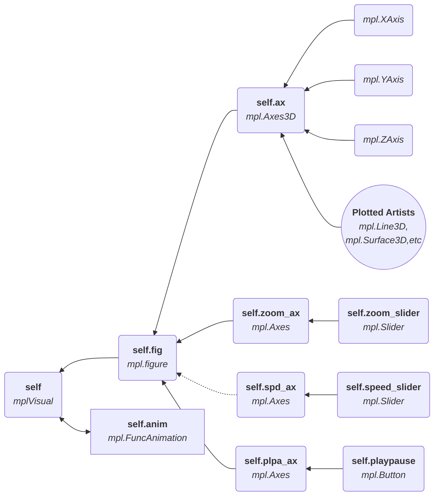

> [!WARNING]
> This Wiki is not regularly updated. this page was last checked for accuracy on **8th December 2023**.

Above is a diagram representing how a set of 3 bodies' trajectories would be structured using `Body`, `Engine` and `mplVisual`. To make the animated output as efficient as possible we choose to simulate the objects in `Engine` before visualising it.

----

## `core.Body(mass,init_pos,init_vel=(0,0,0),radius=0,bounce=0.999,color=None,identity=None)`
This object is the representation of a single (solid) body with finite mass and size. Should be placed into an `core.Engine` instance to perform a simulation.
### Parameters
|Parameter| Required |Type| Description|
|---|---|---| ---|
|`mass` | ✓ | `base.NumType` | mass of the body in kg. |
|`init_pos` | ✓ | `base.Iterable` or `base.VectorType` | initial position of the body in m.|
|`init_vel` | ✕ | `base.Iterable` or `base.VectorType` | initial velocity of the body in ms^-1. Default is `(0,0,0)`.|
|`radius` | ✕ | `base.NumType` | radius of the body in m, modelled as a sphere. Default is `0`. if `radius=0`, collision physics will not be simulated, and will act as a point particle. |
|`bounce` | ✕ | `base.NumType` | coefficient of restitution for the body. the factor describing how much energy is lost in a collision. `1` will give perfect elastic collision, `0` will give a perfect inelastic collision. Default is `0.999`.  |
|`color` | ✕ | `str` | color of the body when visualised. can used colors defined in matplotlib docs.|
### Attributes
|Attribute| Type| Description|
|---|---|---|
| `self.identity` |`str`  | identifiable string to represent the body by. |
| `self.mass` |`base.Variable`  | mass of the body. |
| `self.pos` |`base.HistoricVector`  | positional vectors of body. |
| `self.vel` |`base.HistoricVector`  | velocity vectors of body. |
| `self.acc` |`base.HistoricVector`  | acceleration vectors of body. |
| `self.radius` |`base.Variable`  | radius of the body. |
| `self.bounce` |`base.NumType`  | coefficient of restitution used when the body is in a collision. |
| `self.color` |`str`  | color of the body when visualised. |
### Usage
#### `update(dt=1,vel_change=None,acc_change=None,vel_next=None)`
   - evaluates the bodies current position, velocity and acceleration, along with any optional changes, over a time interval `dt`.

#### `_reinitialise(init_pos=None,init_vel=None)`
  - resets the body to an initial position and length, erasing all other datapoints for position, velocity and acceleration.

#### `get_(ind=-1, plotskip=0, c_mass=None, engine=None)`
   - <!--needs description-->
### Indexing
- Supports numerical indexing but not slicing.

| Index | Returns|
|---|---|
|`'pos'`| all points of position as a 2d array.|
|`'vel'`| all points of velocity as a 2d array.|
|`'acc'`| all points of acceleration as a 2d array.|
|`'current'`| 2d array containing the current position, velocity and acceleration.|
|`'info'`| dictionary containing all non kinematic properties of the body|
|`'x'`| 2d array containing all x components of position, velocity and acceleration vectors.|
|`'y'`| 2d array containing all y components of position, velocity and acceleration vectors.|
|`'z'`| 2d array containing all z components of position, velocity and acceleration vectors.|

----

## `core.Engine(dt=1,checking_range=3)`
This object acts as the physics engine, and simulates the gravitational effects of bodies, and can also simulate collisions as well.
### Parameters
|Parameter| Required |Type| Description|
|---|---|---| ---|
|`dt` | ✕ | `base.NumType` | interval in seconds between each datapoint in the simulation. Lowest will produce most accurate results. Default is `1`(second). |
|`checking_range` | ✕ | `int` | range of points to check for collisions over for each point. Default is `3`.|

### Attributes
|Attribute| Type| Description|
|---|---|---|
| `self.bodies` |`list`  | internal collection of bodies that have been attached. |
| `self.planes` |`list`  | internal collection of planes that have been defined. |
| `self.fields` |`list`  | internal collection of fields that have been defined. |
| `self.dt` |`base.NumType`  | see `dt` above |
| `self.do_collisions` |`bool`  | whether to calculate the effect of collisions with planes or other bodies when simulating the trajectories. Default=`True`. |
| `self.do_bodygravity` |`bool`  | whether to calculate the effect of gravity due to other bodies when simulating the trajectories. Default=`True`.|
| `self.do_fieldgravity` |`bool`  | whether to calculate the effect of fields when simulating the trajectories. Default=`True`.|

### Usage
#### `attach_bodies(new_bodies)`
   - attaches `core.Body` objects to the `Engine` instance. `new_bodies` must be passed as a `base.Iterable`.

#### `save_as(dump='engine',file_name='nbody_data')`
   - saves the current state and all child objects as an .npz file.
        * `dump` = either  `engine` or `bodies`, choosing to save engine with all children or just the `core.Bodies` objects.
#### `load_as(objects='engine',file_name='nbody_data')`
   - loads the chosen file data into the `Engine` instance. `objects` = either `engine` or `bodies` and this specifies the target object(s) to load.
#### `make_relative_to(target_body)`
   - reinitialises all bodies in the instance, changing the initial conditions so that `target_body` is located at (0,0,0) and the rest of the objects have the same initial conditions relative to `target_body`.
#### `create_acceleration(accel_vector)`
   - creates a constant field of acceleration that can affect the simulated trajectories of bodies.
     * `accel_vector` must be an iterable or `base.VectorType` instance.
>[!WARNING]
> if the value of an acceleration field or a body's velocity is sufficiently high, a body may fail to register a collision with a plane or another body.
>
> In these instances, it is neccesary to reduce `dt`. *(and increase `checking_range`, which will sample more points resulting in an earlier check collision being registered.)*
#### `create_plane(const_axis= 'z', const_val= 0)`
   - creates an infinite plane with 0 thickness, parallel to a chosen euclidean plane. `const_axis` specifies the plane orientation, e.g, `'z'` would return a plane parallel to the x-y plane. `const_val` specifies the coordinate value it should be locked to.
#### `simulate(self,intervals)`
  - runs a simulation over a specified amount of `intervals` (must be `int`). does not return anything, but each of the bodies will contain the new data, and the `Engine` instance can now be passed on to a `Visual` object to create an output.

----

## `core.mplVisual(engine,name='NBody Simulation (Matplotib)',show_info=False,show_grid=True,focus_body=None,do_picking=True,**kwargs)`
Object that outputs a visual, animated plot of an `core.Engine` instance, and can be customized to users preferences.
>[!NOTE]
The `core.Engine` instance should already have computed a simulation before insterting into a `mplVisual` instance. 
### Parameters
|Parameter| Required |Type| Description|
|---|---|---| ---|
|`engine` | ✓ | `core.Engine` | engine containing the system that is to be visualized |
|`name` | ✕ | `str` | identifying name of the visual instance. |
|`show_info` | ✕ | `bool` | whether to show a description of live information of the `info_body`(Default: `focus_body`). Default: `False`.|
|`show_grid` | ✕ | `bool` | whether to draw the grid and grid faces of the plot. Default:`True`.|
|`focus_body` | ✕ | `core.Body` | body to keep in the center of the plot. If left as `None`, the plot will not center on a body. Default:`None`|
|`do_picking` | ✕ | `bool` | whether to enable object picking, allowing a user to choose a `focus_body` by clicking on the object, or `info_body` by clicking on the label or legend item.|
### `kwargs`
|Parameter|Type|Default| Description|
|---|---|---|---|
|`step_skip_frames` | `int` |`1` | the step to iterate over of frames. reduces the amount of frames in the final visual, but speeds up the animation. |
|`step_skip_points` | `int` | `1`| the step to iterate over of points. reduces the amount of points in each trail. eg: if `step_skip_frames=10`, and `step_skip_points=5`, each frame would contain 2 more points.| 
|`fps` | `int` | `30`|framerate of the animation.|
|`max_pts` | `int` |`None` |maximum amount of points in each trail to plot. will remove oldest points if `max_pts` is exceeded.|
|`max_period` | `int` |`2` |maximum amount of periods for an object to draw until points are cut.|
|||||
|`vect_params` | `dict` |`{vel:False, acc:False, size:1}` | parameters to show acceleration and velocity vectors and a size scaling factor.|
|`speed_control` | `bool` |`False` |whether to enable a slider in the visual to control the speed.|
|`color_dict` | `dict` |`{line:'black', face:(0,0,0,0), bkgd:'white', text:'black'}` | color pallette used by the visual.|
|`focus_range` | `base.Numtype` | `None`|range to plot the grid around, given `focus_body` is not `None`. if `None`, the visual will autoscale, based on the furthest object.|
|`labelling_type` | `str` | `'legend'`|whether to use labels on objects or a legend. either `legend` or `labels`.|
|`body_model` | `str` |`'dots'` |how to draw the objects. can be `surface` or `wireframe` for spherical surface or `dots` as markers.|
|||||
|`info_body` | `core.Body` |`focus_body` |initial object to show information for.|
|`info_calc` | `bool` |`False` |whether to compute all info strings for objects for all frames prior to animation.|
|`anim_cache` | `bool` |`False` |see `matplotlib.animation.FuncAnimation` parameter `cache`.|
|||||
|`is_running` | `bool` |`True` |value used to toggle animation using play/pause button in visual.|
|||||
|`fmt_params` | `dict` | `?`||
|`file` | `str` |`None` |where to save the `mplVisual` object. if `None` then the object is not saved.|
|`start_index` | `int` |`0` |index of bodies' data to begin animation at.|

### Usage
#### `start(**viewparams)`
   - function to start instances output window and animation. 
   - `viewparams`: parameters to pass to `axes.view_init()`. initial viewing parameters as `elev`, `azim`, `roll`.

### Internals
below is a flowchart outlining the main internal structures of an `mplVisual` instance that come from the `matplotlib` library. you can use this to edit any parameters not defined already by an argument in `mplVisual` after it is initialised but before the `start()` function. all keyword arguments are stored as a dictionary as `self.args`.

## Creating a `core.Body` From a Text File
<!--- description of body_from function and format of text file, see body.txt for example. -->
### The `body_from()` Function

### Using a Text File

