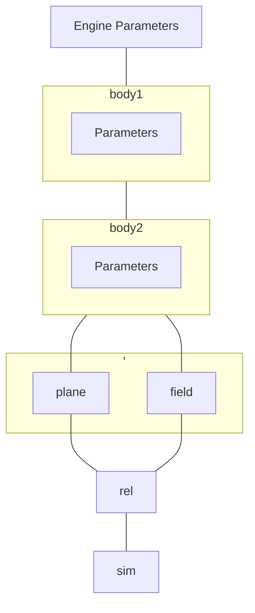

This page covers the following remaining miscellaneous objects and functions in this project:
- the `Formatter` class
- `io` functions:
   * Structure of data files
   * `obj_from()` - Importing data
   * `export_data()` - Exporting Objects
> [!WARNING]
> This Wiki is not regularly updated. this page was last checked for accuracy on **8th December 2023**.
----

## The Formatter Class
### `text.Formatter(output_raw=False, items=('identity','mass','radius','energy','period','pos','vel','acc','time'), vector_pos=True, vector_vel=False, vector_acc = False, engine=None, plotskip=0, c_mass=0)`
Class used to format information about `core.Body` instances to be human readable and in useful units. Primarily used in the info readout in the `core.mplVisual` class.

>[!NOTE]
It is possible to change the default units to convert to by changing lists that are found in the module code (`text.py`).

### Useful Parameters
|Parameter| Required |Type| Description|
|---|---|---| ---|
|`output_raw` | ✕ | `bool` | whether to convert quanities or not. Default:`False`|
|`items` | ✕ | `tuple` | quantities to output to a string Default:`('identity','mass','radius','energy','period','pos','vel','acc','time')`(contains all possible quantities) |
|`vector_pos` | ✕ | `bool` | whether to output position as a magnitude or full vector. Default:`False`|
|`vector_vel` | ✕ | `bool` | whether to output velocity as a magnitude or full vector. Default:`False`|
|`vector_acc` | ✕ | `bool` | whether to output acceleration as a magnitude or full vector. Default:`False`|
|`engine` | ◑ | `core.Engine` | **Reqiured for outputting `time`**. Engine instance the body/ies of interest belong to. Default:`None`|
|`plotskip` | ◑ | `int` | **Reqiured for outputting `period` and `energy`**. effectively the `step_skip_frame` value of a `core.mplVisual` instance. Step used when calculating estimate over the bodies' positions. Default:`1`|
|`c_mass` | ◑ | `base.NumType` | **Reqiured for outputting `period`**. effectively the `major_body` value of a core.mplVisual instance. mass of largest body used when calculating estimate over the bodies' positions and mass. Default:`1`|

### Useful Attributes
|Attribute| Type| Description|
|---|---|---|
| `self.target` |`list`  | target body and index, needs to be assigned a value for valid output. Default:`[None, 0]` |


### Usage
#### `convert(arg=None)`
   - converts either `arg`(a dictionary with keys being in `items` and values as `pint.Quantity` instances), or target body and index into the ideal units, and outputs as a list of `pint.Quantity` instances,
#### `str(Formatter())` or `f'{Formatter()}'`
   - returns a formatted string of the quantities for the target body and index.


### Example:
starting with an engine with an arbitrary number of bodies that has simulated some unknown system:
```python
phys = core.Engine(...)
phys.bodies = (core.Body(...), 
                ...)
```
create a `Formatter` instance and assign a target body and index (here we will look at the first body and the last entry and we are only interested in the position as a vector and time):
```python
>>> info = text.Formatter(items=('identity','pos','time'), vector_pos=True, engine=None)
>>> info.target = [phys.bodies[0], -1]
```
Finally, print the `Formatter` object as a string.
```python
>>> print(str(info))
BodyName
pos: (123.56 m, 789.10 m, 111.213 m)
time: 12.53 a
```
>[!NOTE]
The output units can sometimes be in non standard fractional units, for example a body with a mass equivalent to 0.0123 solar masses will output as 1.23 mM₀.

----

## `io` functions
### 1. Structure of data files
an example of a text file for a set of bodies in an engine is below.
```python
# eng_info.txt

dt = 1.23
checking_range = 3
# bodies:(2)
~ do_collisions = False
~ do_fieldgravity = True
~ do_bodygravity = True
*Obj_1 [
name = object_name
mass = 1.4213
radius = 23.124
position = (6211, 6211.500, 6211.500)
]
*Obj_2 [
name = object_name2
mass = 2.0
radius = 2.0
position = (6212.57166, 6211.51, 6211.51)
]
-* plane = z = 3
-* plane = x = 1
-* field = (1,1,1)
-* rel = Obj_1

-* sim = 100
```
#### Prefixes
|Prefix | Usage |
|- | -|
|`~`|assigning attribute values|
|`*`|denoting a body|
|`-*` |calling functions|
|`#`| comments and supplementary data|
>[!NOTE]
Vectors or list like items must always use round parentheses.
#### Structuring a Body
a definition of a body begins with an identifier prefixed with an asterisk and all of its parameters then go inside a set of square brackets, the open on the same line as the identifier and the close on a separate line, directly after the last parameter:
```
*{object_id} [
{parameters}
]
```
the following parameters can be defined for a Body:
```python
name[id, identity], mass, radius, position[pos], velocity[vel], color[colour], bounce.
# items in sq. brackets are alternative options.
```
#### A Set of Positions
it is possible to pass a set of positions to create a body with past data as shown below:
```python
*Obj [
name = object_name
mass = 1.4213
position = ( # signified by curly brackets:
(1,2,3) # entry 1
(4,5,6) # entry 2
(7,8,9) # entry 3
) # close position data
radius = 23.124
]
```
See the `obj_from()` function for information on parsing this type of format.
#### Defining Objects and Calling Functions for an Engine
It is possible to call specific functions relating to the `Engine` object that could be created, using the `-*` prefix as described before. There are 4 functions that can be called:
```python
-* plane = {const_axis} = {const_val} # see Engine.create_plane()

-* field = ({x}, {y}, {z}) # see Engine.create_acceleration()

-* rel = {object_id} # see Engine.make_relative_to()

-* sim = {intervals} # see Engine.simulate()
```
These must be ordered in a logical order, i.e. initialising planes before simultating otherwise the planes wouldn't exist at that point.
#### Basic ordering of File Contents

----
### 2. `obj_from(object, obj = 'engine')`
Function to parse a text file and create an object.
#### Parameters
- `object`: the text file containing the object data
- `obj` : parsing type, the type of object to find.
   * must be one of:
      - `'body'`: a body with standard data
      - `'bodyext'`: a body with a sequence of positions
      - `'engine'`: an engine with standard data
#### Returns
- either a `core.Engine` instance or `core.Body` instance.

----
### 3. `export_obj(object, loc, overwrite = False, info_name = None, csvs = True)`
Function to extract data from an object to a text file and optionally a csv per Body. if a `core.Engine` is input, it will export Body data as well for all bodies contained in it.
#### Parameters
- `object`: the object to get data from, can be a `core.Engine` instance or `core.Body` instance.
- `loc` : location or folder name to create with all data inside.
- `overwrite` : whether to overwrite files and folders.
- `info_name` : name of the text file (Optional).
- `csvs` : whether or not to export full pos, vel and acc data to a csv as well.
#### Returns
- `None`
